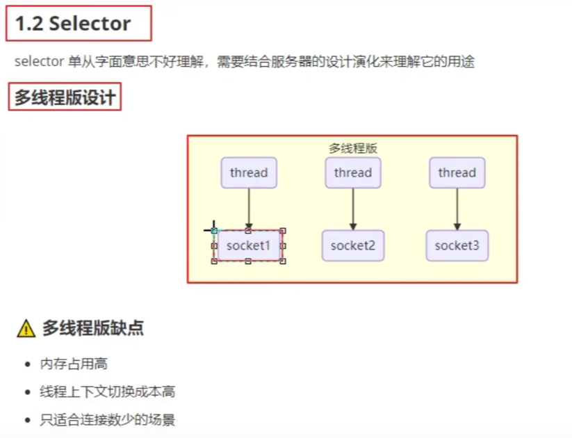
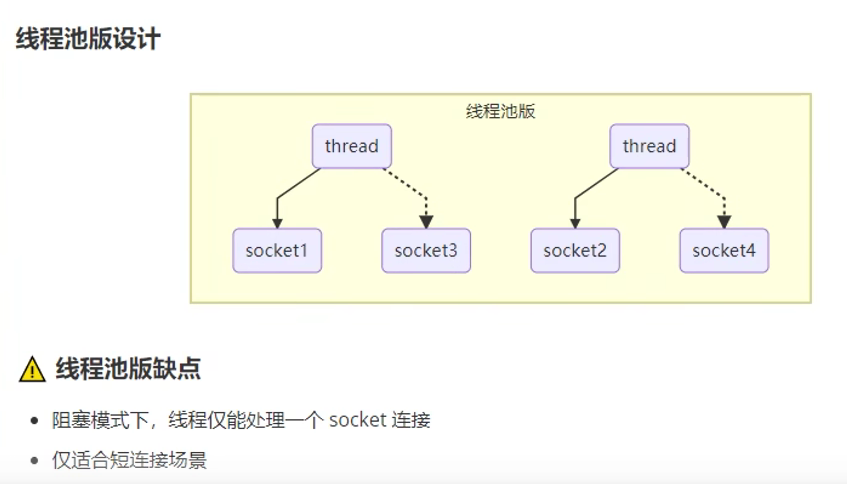

# netty-study
netty学习

# NIO 基础

## 1.三大组件
- Channel
- Buffer： 内存缓冲区。暂存数据
- Selector：选择器，用于监听多个Channel的事件

## 1.常见的Channel
- FileChannel: 文件传输通道
- DatagramChannel：UDP传输通道
- SocketChannel:  TCP传输通道
- ServerSocketChannel:  TCP传输通道， 专用于服务器

## 2.Buffer
- 容量(capacity)
- 限制(limit)
- 位置(position)
- 标记(mark)

## 3.Selector
多线程版本设计

线程池版本

同一时刻内，一个线程只能处理一个socket上的操作

- 事件(Event)
- 选择器： 用于监听多个Channel的事件
- 事件类型：
  - 连接事件
  - 读取事件
  - 写入事件